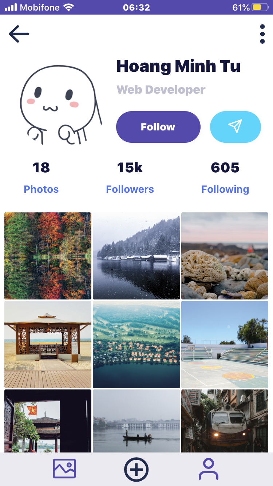

# Instagram App's Profile Page Clone

Code submission for the second week's assignment of the 2020 React Native course organised by Facebook Developers' Circle Hanoi.

## Screenshots

## Installation Notes 

To run this project, besides *NPM CLI/Yarn CLI*, you also need to have *Expo CLI* installed on your computer. 

### Sidenotes on How To Turn Android Emulator On

0. In Ubuntu: add these directories to `$PATH`: 
  - `~/Android/Sdk/tools/bin`
  - `~/Android/Sdk/platform-tools`
  - `~/Android/Sdk/emulator`
1. `adb devices`
2. `emulator -avd <device name>`. For me, my virtual device name is 'Pixel3a'.

## TODOs for the next versions

- [ ] Load custom fonts
- [ ] Cache fonts, icons and other assets
- [ ] Transition animation
- [ ] Spinner loading indicator
- [ ] Dark theme
